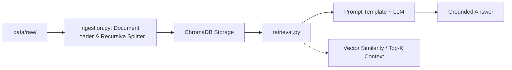

# Aether Wireless - Production-Ready RAG Pipeline

An enterprise Retrieval-Augmented Generation (RAG) system built incrementally to answer complex customer service, billing, and technical support queries for **Aether Wireless**.

---

## 1. Who Is the Customer?

**Aether Wireless** is a fictitious regional telecommunications provider offering fiber internet, mobile voice/data plans, and enterprise network solutions.

- **Target Users**: Customer support agents and end-use subscribers.
- **Knowledge Base**: Internal policy docs (.txt), rate cards, coverage maps, and multi-page technical specification sheets (.pdf) stored in `data/raw/`.

---

## 2. What Was Broken?

Standard keyword search and basic LLM usage failed on Aether Wireless documentation due to several production blockers:

| Problem | Impact |
|---------|--------|
| **Hallucinated Rates & Policies** | Off-the-shelf LLMs hallucinated tier prices and data cap limits not grounded in actual policy. |
| **Unstructured PDF Loss** | Standard text matchers completely missed information embedded inside multi-column PDF tables and rate matrices. |
| **Loss of Context** | Naive fixed-character chunking cut sentences mid-string, causing isolated search hits to lose critical qualifying conditions (e.g., "Fee waived if paid within 5 days"). |

---

## 3. What Did You Build?

A modular, two-stage RAG architecture built using Python, ChromaDB, and OpenAI/Sentence-Transformers.

| Component | Description |
|-----------|-------------|
| `ingestion.py` | A robust parsing and indexing pipeline that recursively splits structured .txt and multi-format .pdf documents, attaches rich metadata, and generates vector embeddings stored in a local persistent vector store. |
| `retrieval.py` | A hybrid search engine combining dense vector similarity with metadata filtering to fetch precise context blocks and deliver grounded LLM responses. |
| `PROGRESS.md` | An engineering ledger tracking every problem, design choice, and bottleneck across the development lifecycle. |

---

## 4. How Does It Work?

### Ingestion (`ingestion.py`)

Loads files from `data/raw/`, recursively splits text into overlapping semantic chunks (e.g., 500 tokens with 50-token overlap), embeds each chunk, and saves it into ChromaDB alongside document metadata.

### Retrieval (`retrieval.py`)

Accepts a natural language query, computes its embedding vector, performs a nearest-neighbor search over ChromaDB, formats the top-K retrieved context blocks into a guarded prompt, and synthesizes a grounded answer.

---

## 5. How Did You Evaluate It?

The system was validated using the **RAG Triad** framework:

| Metric | Focus | Verification Method | Target Threshold |
|--------|-------|---------------------|------------------|
| **Context Relevance** | Are retrieved chunks relevant to the user query? | Verified top-K chunks manually against test queries in `PROGRESS.md` | Precision @ K ≥ 85% |
| **Groundedness** | Is the answer derived strictly from retrieved context? | Tested against adversarial queries (e.g., asking about non-existent plans) | Zero hallucinated plan rates |
| **Answer Relevance** | Does the answer directly address the user's prompt? | Compared output summaries against known customer support ground truth | Human evaluation score ≥ 4/5 |

---

## 6. What Would You Change Before Production?

Before deploying this pipeline into a live customer-facing environment, the following structural upgrades are required:

| Area | Upgrade |
|------|---------|
| **Search** | Integrate BM25 sparse matching alongside dense vector search to accurately capture specific plan model numbers and codes (e.g., `AW-FIBER-1000`). |
| **API & Caching** | Wrap `retrieval.py` in a FastAPI interface with Redis semantic caching for frequently asked questions to bring response latency under 200ms. |
| **Continuous Evaluation** | Replace manual log checking with an automated evaluation framework (e.g., Ragas or DeepEval) integrated into CI/CD pipelines. |
| **Access Control** | Add strict metadata-level row security (RBAC) so tiered plan details or internal support notes are only exposed to authorized user roles. |

---